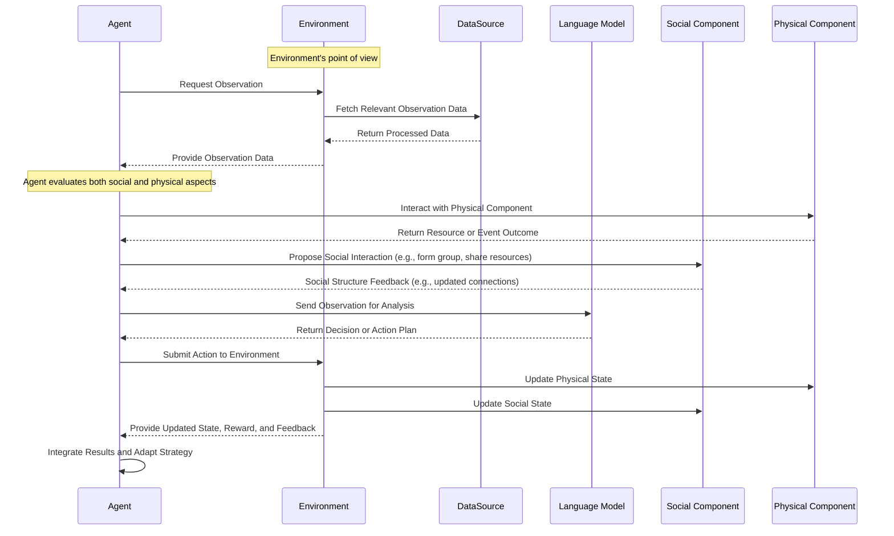

# Using AdaSociety with LLM Agents

AdaSociety supports using Large Language Models (LLMs) to control agents within the environment. This guide provides detailed instructions on how to set up and use AdaSociety with LLM-based agents, including a quickstart guide for running mini-games with default settings.

## Prerequisites

- **Anaconda or Miniconda**: Ensure you have [Anaconda](https://www.anaconda.com/products/distribution) or [Miniconda](https://docs.conda.io/en/latest/miniconda.html) installed.
- **Python 3.10**: AdaSociety requires Python 3.10.
- **OpenAI API Key**: Obtain an API key from [OpenAI](https://platform.openai.com/account/api-keys) for LLM integration.

## Setup Instructions

### 1. Create a New Conda Environment

Open your terminal and execute the following commands to create and activate a new conda environment named `adasociety`:

```bash
conda create -n adasociety python=3.10
conda activate adasociety
```

### 2. Clone the AdaSociety Repository

Clone the AdaSociety repository from GitHub and navigate into the project directory:

```bash
git clone https://github.com/TINKPA/AdaSociety.git
cd AdaSociety
```

### 3. Install Required Dependencies

Install the required Python packages using `pip`:

```bash
pip install -r requirements.txt
```

### 4. Set Up OpenAI API Key

Set your [OpenAI API key](https://platform.openai.com/account/api-keys) as an environment variable:

```bash
export OPENAI_API_KEY='your-api-key-here'
```

Replace `'your-api-key-here'` with your actual OpenAI API key.

## Quickstart Guide

To quickly start a mini-game with default settings, follow the steps below.

### 1. Run a Mini-Game

You can start any of the predefined mini-games using the `llm_main.py` script with the `--task_name` argument. For example, to run the **Easy Negotiation** mini-game with default settings:

```bash
python llm_main.py --task_name "easy_negotiation"
```

This command initializes the **Easy Negotiation** mini-game using the default configurations.

### Available Mini-Games

Here is a list of available mini-games you can run:

- **Contract Mini-Games**

  - **Easy Contract**

    ```bash
    python llm_main.py --task_name "easy_contract"
    ```

  - **Hard Contract**

    ```bash
    python llm_main.py --task_name "hard_contract"
    ```

- **Negotiation Mini-Games**

  - **Easy Negotiation**

    ```bash
    python llm_main.py --task_name "easy_negotiation"
    ```

  - **Hard Negotiation**

    ```bash
    python llm_main.py --task_name "hard_negotiation"
    ```

- **Social Structure Mini-Games**

  - *Unconnected*

    ```bash
    python llm_main.py --task_name "social_structure_unconnected"
    ```

  - *Connected*

    ```bash
    python llm_main.py --task_name "social_structure_connected"
    ```

  - *Individual Group*

    ```bash
    python llm_main.py --task_name "social_structure_ind_group"
    ```

  - *Overlapping Group*

    ```bash
    python llm_main.py --task_name "social_structure_ovlp_group"
    ```

  - *Hierarchical*

    ```bash
    python llm_main.py --task_name "social_structure_hierarchical"
    ```

  - *Dynamic*

    ```bash
    python llm_main.py --task_name "social_structure_dynamic"
    ```

Each mini-game comes with its default settings, and you can run them directly using the commands above.

## Understanding the Output

When you run AdaSociety with LLM-controlled agents, the program outputs information reflecting the agents' interactions within the environment. Understanding this output is essential for analyzing agent behavior, evaluating strategies, and debugging.

### Output Format

The output typically includes:

- **Step Information**: Indicates the current step within the episode.
- **Agent Observations**: Details about each agent's perception of the environment, including both physical and social components.
- **Agent Thoughts and Plans**: The reasoning process of the agents and their decided actions.
- **Rewards**: The rewards received by agents based on their actions and accumulated resources.
- **Episode Termination**: Information indicating whether the episode has ended.

### Interpreting the Output

#### Step Information

Each output block begins with the current step number:

```
Step: 50
```

This indicates that the agents are at step 50 in the current episode.

#### Agent Observations

Agents receive observations from both the physical and social components of AdaSociety:

- **Physical Observations**:

  - **Resources in View**: Types of resources within the agent's observation window, their quantities, and distances.

    ```
    The resources in your observation are: [Wood, Stone].
    The distances of them are [5, 4] steps away.
    The numbers of them are [5, 4] respectively.
    ```

  - **Event Grids**: Available events (e.g., crafting opportunities) in the agent's vicinity.

    ```
    The event grid in your observation are: [Hammer Event].
    The distances of them are [0] steps away.
    ```

  - **Nearby Agents**: Other agents within the observation window and their distances.

    ```
    The people in your observation are: [miner_1],
    The distances of them are [1] steps away.
    ```

  - **Inventory**: The agent's current inventory status.

    ```
    Your current inventory: You have 3 wood.
    ```

- **Social Observations**:

  - **Social Environment**: Description of the current social structure or coalitions.

    ```
    Current surrounding social environment: [{carpenter_0, carpenter_1, carpenter_2, carpenter_3, miner_0, miner_1, miner_2, miner_3}].
    ```

  - **Payoff Structure**: The rewards distribution among agents in the coalition.

    ```
    Payoff: 0.1, 0.1, 0.1, 0.1, 0.1, 0.1, 0.2, 0.2
    ```

#### Agent Thoughts and Plans

Agents process their observations and formulate thoughts and plans accordingly. This section reflects the agent's reasoning and the action they plan to execute.

- **Thoughts**: An internal monologue where the agent analyzes the current state.

  ```
  Thoughts: I'm carpenter_0, and I currently have 3 woods in my inventory. In my observation, there is wood and stone nearby, which I can gather. The Hammer-craft event is also close by, allowing me to craft a hammer. But I don't have enough material to craft a hammer, so I need to gather resources. Since I have 3 woods, I need to gather 3 stones.
  ```

- **Plan**: The action the agent intends to perform, chosen from predefined options.

  ```
  Plan: GATHER 3 STONE.
  ```

  The available action options for the agents are:

  - **GATHER \<NUM> \<RESOURCE>**: Collect a specified number of a resource (e.g., wood, stone, iron, torch).
  - **CRAFT 1 HAMMER**: Use resources in the inventory to craft a hammer at a hammer crafting event grid.
  - **EXPLORE MAP**: Move randomly to discover new areas and resources.
  - **DUMP HAMMER**: Discard a hammer from the inventory (useful when the agent's capacity is full).

#### Rewards

Agents receive rewards based on the value of the resources in their inventory and the successful completion of actions like crafting. The reward structure considers both the agent's preferences and the objective value of resources.

- **Resource Value**: Each resource has an assigned value, and agents may have different preferences.

  For example, for a carpenter:

  - Wood: 1
  - Stone: 1
  - Hammer: 5
  - Coal: 10
  - Torch: 30
  - Iron: 20

#### Episode Termination

Information about whether the episode has ended due to reaching a termination condition or completing the task.

### Using This Information

By interpreting the output, you can:

- **Analyze Agent Behavior**: Understand how agents make decisions based on their observations and objectives.
- **Evaluate Strategies**: Assess the effectiveness of agents' plans and their adaptability to the environment.
- **Debug and Optimize**: Identify areas where agents may not be performing optimally and adjust parameters or strategies accordingly.

### Example Output Block

Here's an example of an output block along with its interpretation:

```
---

Step: 90

Current surrounding social environment:
[{'carpenter_0', 'miner_1'}, {'carpenter_1', 'miner_1', 'miner_2', 'carpenter_2', 'miner_3', 'carpenter_3'}]

Payoff: 0.6, 0.1, 0.1, 0.2, 0.2, 0.4, 0.2, 0.2

Current surrounding physical environment:

The resources in your observation are: [Wood, Stone].
The distances of them are [5, 4] steps away.
The numbers of them are [5, 4] respectively.

The event grid in your observation are: [Hammer Event].
The distances of them are [0] steps away.

The people in your observation are: [miner_1],
The distances of them are [1] steps away.

You have 4 wood, 6 Stone, 1 hammer.

Thoughts: I'm carpenter_0. In my coalition, there are mostly stones and a minority of wood. I can craft hammer heads first to help the coalition gain greater profits. Miner_1 is in my coalition and is closer than other people. To prevent my hammer from being gathered by another coalition, and since miners with hammers can bring more rewards to the coalition, I will dump the hammer.

Plan: DUMP HAMMER.

---
```

**Interpretation**:

- **Step**: The agents are at step 90 of the episode.
- **Social Environment**: Carpenter_0 is in a coalition with Miner_1, separate from another larger coalition.
- **Payoff**: Indicates how rewards are distributed among agents, with Carpenter_0 receiving a larger share (0.6).
- **Physical Environment**: Carpenter_0 observes wood and stone nearby and is adjacent to a Hammer Event grid.
- **Inventory**: Carpenter_0 has 4 wood, 6 stone, and 1 hammer.
- **Thoughts**: The agent wants to aid the coalition by providing hammers to miners, enhancing overall profits.
- **Plan**: The agent decides to dump a hammer for Miner_1 to collect.

### Terms and Concepts

- **Agent**: An autonomous entity within AdaSociety, such as a carpenter or miner.
- **Social Component**: The network of relationships between agents, influencing information sharing and rewards.
- **Physical Component**: The tangible elements in the environment, including resources and events.
- **Inventory**: The collection of resources and items an agent possesses.
- **Coalition**: A group of agents collaborating, often sharing rewards and objectives.
- **Event Grid**: Specific locations where agents can perform actions like crafting.

## Accessing the Output Logs

### Output Location

By default, the output of running AdaSociety with LLM agents is saved to log files in the `project/tasks/llm/outputs/` directory. The output files are generated based on the task name and episode number.

For example, if you run the **Easy Negotiation** mini-game, the output files will be:

- `project/tasks/llm/outputs/output_easy_negotiation_0.txt` (for the negotiation phase)
- `project/tasks/llm/outputs/output_easy_negotiation_physical_0.txt` (for the physical phase)

### File Naming Convention

The output files follow the naming pattern:

- For the initial phase (e.g., negotiation or contract phase):

  ```
  output_<task_name>_<episode>.txt
  ```

- For the physical phase:

  ```
  output_<task_name>_physical_<episode>.txt
  ```

Here, `<task_name>` is the name of the task you specified, and `<episode>` is the episode number (starting from 0).

### Viewing the Output Files

To view the output, you can open the text files using any text editor or use command-line tools like `cat`, `less`, or `more`. For example:

```bash
cat project/tasks/llm/outputs/output_easy_negotiation_0.txt
```

These files contain the detailed interactions, agents' thoughts, plans, and actions throughout the episode.

## Customizing Agents and Environment

You can customize the behavior of LLM agents and environment settings by modifying the task configuration files located in `config/task/llm/`. Refer to the [JSON Configuration File Documentation](./config/README.md) for detailed instructions on adjusting parameters such as the number of agents, resource types, and social structures.

Additionally, you can craft custom `env_handler` and `agent` classes through Python code for greater flexibility and control. The `llm_main.py` script initializes the environment and agents based on the selected mini-game and task configurations.



## Additional Resources

- **AdaSociety Paper**: For an in-depth understanding of the environment and theoretical framework, refer to the [AdaSociety Paper](./AdaSociety.md).
- **LLM Integration Documentation**: Detailed explanation on how AdaSociety integrates with LLMs can be found in the [LLM README](./project/tasks/llm/README.md).
- **Agent and Environment Handler Implementation**: For customizing agent behaviors and environment dynamics, refer to the [Agent Documentation](./project/agent/README.md).
- **Training Agents via RLlib**: Instructions for training agents using RLlib are available in the [RLlib README](./project/RLlib/README.md).

## Troubleshooting

- **OpenAI API Errors**: Ensure your API key is correctly set and has the necessary permissions. Check if the environment variable `OPENAI_API_KEY` is properly exported.
- **Dependency Issues**: Verify that all dependencies are installed as specified in the `requirements.txt` file.
- **Environment Variables**: If the `OPENAI_API_KEY` is not recognized, confirm that you have exported the variable in the same terminal session where you are running the script.
- **Log File Not Found**: If the log files are not created, ensure that the `outputs` directory exists and that you have write permissions. The `llm_main.py` script writes output files to `project/tasks/llm/outputs/`.

---

By following these instructions, you can quickly start a mini-game with default settings, understand where the output files are saved, and interpret the agents' behaviors within AdaSociety. If you have any questions or encounter issues, please refer to the [GitHub repository](https://github.com/TINKPA/AdaSociety) or the documentation provided in the project for further guidance.
